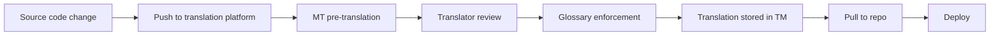

# translation-memory-2026

**Issue:** A translation team translates 1000 strings for a new feature. Six months later, similar strings appear in another feature. Translators start from scratch. Inconsistent terminology, wasted time.
**Date:** 2026-08-10
**Repo:** example-org/example-repo
**Author:** ORCHORDS
**Status:** published

## Symptom

Translation is treated as a one-time cost per release. Similar strings across features get translated multiple times, with different wording for the same concept. Terminology drifts; consistency suffers.

## Root cause

Translation memory (TM) is a database of previously translated segments (sentences, phrases, terms) that suggests matches for new content. Leveraging existing translations reduces cost, improves consistency, and accelerates turnaround. The standard exchange format is TMX (Translation Memory eXchange).

## The TM leverage levels

When a new segment is submitted, the TM system returns matches at different levels:

| Match level | Threshold | Typical use |
|---|---|---|
| Exact (100%) | Identical text | Auto-accept or just review |
| 95-99% | Punctuation, whitespace, or case difference | Auto-accept with review |
| 75-94% | Single word or short phrase change | Review and edit |
| 50-74% | Multiple word changes | Use as reference, retype |
| <50% | Substantial difference | No leverage; translate fresh |

The higher the match, the less human work. A mature TM can push 60-80% of segments to ≥75% match.

## The terminology glossary

Beyond segment-level TM, maintain a **terminology glossary** (TBX format) of key terms with approved translations:

- "Save" → "Speichern" (German, not "Sparen")
- "Submit" → "Enviar" (Spanish, not "Someter")
- "Delete" → "Eliminar" (Spanish, not "Borrar")

The glossary enforces consistency. Translators consult it before submitting. CAT tools (SDL Trados, memoQ, Wordfast) integrate TM + glossary + machine translation in a single workflow.

## The 2026 tooling landscape

- **Phrase** (formerly Memsource) — cloud-based CAT with TM, glossary, MT integration
- **Lokalise** — developer-focused with CI/CD integration
- **Crowdin** — open-source-friendly with GitHub sync
- **POEditor** — simpler, Git-based
- **Transifex** — enterprise with i18n workflow
- **Smartling** — enterprise translation with visual context

Most provide API-driven translation memory, glossary management, and machine translation post-editing (MTPE) workflows.

## The integration pattern

```yaml
# CI integration: push source strings, pull translations
- name: Push source strings to translation platform
  run: |
    curl -X POST "$PHRASE_API/upload" \
      -H "Authorization: Bearer $PHRASE_TOKEN" \
      -F "file=@locale/messages.pot" \
      -F "locale_id=en"

- name: Wait for translations
  run: sleep 300

- name: Pull translations
  run: |
    curl -X GET "$PHRASE_API/download?locale_id=fr" \
      -H "Authorization: Bearer $PHRASE_TOKEN" \
      -o locale/fr/LC_MESSAGES/messages.po
```

Source strings push on every release. Translations pull after the translation team has completed them. The CI pipeline bridges development and translation.

## The 4 quality metrics

Track translation quality over time:

- **TM leverage rate** — % of segments matched at ≥75% (target: 60-80%)
- **First-pass quality** — % of segments accepted without edit by reviewer (target: 80%+)
- **Glossary compliance** — % of key terms using approved translation (target: 95%+)
- **Turnaround time** — hours from source push to translation pull (target: depends on team)

## The MT post-editing pattern

Modern translation platforms integrate machine translation (DeepL, Google, GPT-4) as a starting point. The translator edits the MT output rather than translating from scratch. The MT suggestions feed back into TM, so future similar strings leverage the post-edited TM.

The discipline: track whether MT was used and how much the editor changed. A high post-edit distance (the translator changed 50%+ of the MT output) indicates the MT is poor for that domain; a low distance indicates high quality.

## The continuous localization pattern



Source changes push automatically. Translations happen in the platform. Pulls happen on demand. The TM accumulates over time; leverage increases.

## Verification

The tell that TM is working:

- Translators see ≥75% match on most segments
- Glossary compliance is ≥95%
- Terminology is consistent across features
- Turnaround time decreases over months as TM grows
- New translators onboard faster using the TM as a reference

The tell it isn't:

- Translators translate "Save" differently in different features
- Each release requires translating from scratch
- Terminology drifts ("submit" vs "send" vs "post")
- No TM is configured in the CAT tool

## Gotchas

- **TM is per-locale, not global.** German TM doesn't help with French.
- **Match levels must be tuned per content type.** UI strings can be more permissive; legal strings stricter.
- **MT quality varies by language pair.** English-German is high; English-Japanese is lower.
- **TM is sensitive to whitespace and tags.** A pure-text TM ignores HTML; a tagged TM preserves it.
- **Glossary is enforced at review, not creation.** The translator can deviate; the reviewer catches.
- **Leverage rate is a lag indicator.** New projects have low leverage; it grows over time.

## Related

- `i18n/gettext-message-extraction-2026.md` — extraction feeds TM
- `i18n/icu-message-format.md` — TM preserves ICU structure
- `i18n/pseudo-localization.md` — pre-validates i18n before TM
- `i18n/locale-negotiation.md` — serving the right locale

## Source URLs (verified 2026-08-10)

- https://www.tmsworldwide.com/standards/tmx
- https://www.lexicool.com/tbx-standard.asp
- https://phrase.com/blog/
- https://lokalise.com/blog/
- https://crowdin.com/blog/
