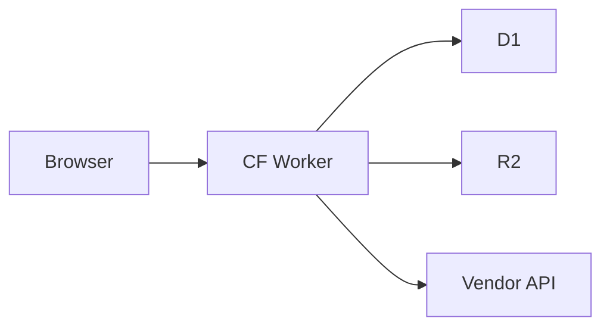

# documentation-as-code

**Issue:** Docs that live with the code, generated from code
**Date:** 2026-08-09
**Status:** documented

## Symptom
Your API has 50 endpoints. The docs are in a separate
Confluence page. The page is 6 months out of date. A new
endpoint is missing. A field name is wrong. The mobile
team uses the docs to build their app. They find a bug.

## Root cause
**Docs and code drift.** If the docs are separate, the
code changes faster than the docs.

**Source:** Various docs-as-code guides.

## The "docs as code" pattern

Three approaches:
1. **In-code comments:** Doc comments next to the function
2. **Code-generated:** OpenAPI from code annotations
3. **Docs site from Markdown:** Markdown in the repo,
   rendered to HTML

Each has its place.

## The "doc comments" pattern

Use JSDoc / TSDoc for inline documentation:
```ts
/**
 * Get a user by ID.
 *
 * @param id - The user's ID (e.g. "u_123")
 * @param context - The request context (tenant-scoped)
 * @returns The user, or null if not found
 * @throws {NotFoundError} If the user doesn't exist
 *
 * @example
 * ```ts
 * const user = await getUser('u_123', ctx);
 * console.log(user.email);
 * ```
 */
export async function getUser(id: string, context: McContext): Promise<User | null> {
  // ...
}
```

The doc is next to the code. When the code changes, the doc
is right there.

## The "OpenAPI from code" pattern

For REST APIs, generate OpenAPI from Zod schemas:
```ts
import { z } from 'zod';
import { extendZodWithOpenApi } from '@asteasolutions/zod-to-openapi';

extendZodWithOpenApi(z);

const UserSchema = z.object({
  id: z.string().openapi({ example: 'u_123' }),
  email: z.string().email().openapi({ example: 'alice@example.com' }),
  displayName: z.string().openapi({ example: 'Alice' }),
  role: z.enum(['viewer', 'admin', 'owner']).openapi({ example: 'viewer' }),
}).openapi('User');

const UserPaths = {
  '/api/users/{id}': {
    get: {
      summary: 'Get a user',
      parameters: [
        { name: 'id', in: 'path', required: true, schema: { type: 'string' } },
      ],
      responses: {
        200: {
          description: 'The user',
          content: { 'application/json': { schema: UserSchema } },
        },
        404: { description: 'User not found' },
      },
    },
  },
};
```

Generate OpenAPI:
```ts
import { OpenAPIRegistry, OpenApiGeneratorV3 } from '@asteasolutions/zod-to-openapi';

const registry = new OpenAPIRegistry();
registry.register('User', UserSchema);
registry.registerPath(UserPaths['/api/users/{id}']);

const generator = new OpenApiGeneratorV3(registry.definitions);
const openapi = generator.generateDocument({
  openapi: '3.0.0',
  info: { title: 'My API', version: '1.0.0' },
});
```

The OpenAPI spec is always in sync with the code.

## The "docs site" pattern

For larger docs (tutorials, guides), use a static site
generator:
- **Docusaurus** (React-based)
- **VitePress** (Vue-based)
- **Astro** (framework-agnostic)
- **Mintlify** (hosted)
- **GitBook** (hosted)

The docs are Markdown files in the repo. The site is
generated at build time.

```
docs/
  getting-started.md
  api/
    users.md
    posts.md
  guides/
    auth.md
    payments.md
```

The team edits the Markdown; the site is auto-generated.

## The "diagrams as code" pattern

For architecture diagrams, use Mermaid (Markdown-embedded):
```markdown


The diagram is in the Markdown; it renders in the docs site.

## The "ADRs" pattern

For architecture decisions, use Architecture Decision
Records (ADRs):
```markdown
# ADR-001: Use D1 over Postgres

## Status
Accepted (2026-08-09)

## Context
We need a database for our app. Options: D1 (Cloudflare
SQLite), Postgres, DynamoDB.

## Decision
We use D1.

## Consequences
- Pros: cheap, fast, edge-replicated
- Cons: 10GB limit, single-region writes

## Alternatives considered
- **Postgres:** More features, but more expensive
- **DynamoDB:** Faster at scale, but more complex
```

The ADR is in the repo; the team can read the history of
decisions.

## The "auto-generated API docs" pattern

For libraries, use TypeDoc:
```bash
typedoc src/index.ts --out docs/api
```

The API reference is generated from TSDoc comments.

## The "example code in docs" pattern

Every doc should have a runnable example:
```markdown
## Get a user

```ts
import { getUser } from '@myorg/api';

const user = await getUser('u_123');
console.log(user.email);
```

The example is tested in CI; if the API changes, the test
fails.

## The "links between docs" pattern

Use relative links:
```markdown
See Auth for more.
```

The link is relative to the file; renames work.

## The "doc review" pattern

Treat docs like code: review, lint, deploy.

```yaml
# .github/workflows/docs.yml
- name: Lint markdown
  run: npx markdownlint docs/

- name: Check links
  run: npx markdown-link-check docs/**/*.md

- name: Build site
  run: npx docusaurus build

- name: Deploy
  run: npx wrangler pages deploy build/
```

A bad link in the docs is a broken doc; a typo is a
misleading doc.

## The "doc coverage" pattern

For public APIs, require docs:
- [ ] TSDoc comment on every exported function
- [ ] Example for every public function
- [ ] Description of every parameter
- [ ] Description of every return value
- [ ] Errors thrown
- [ ] Edge cases

A function without docs is a function nobody understands.

## Verification
- **Test:** Example code in docs is tested
- **Live:** Docs site is deployed
- **Audit:** Quarterly review of doc accuracy

## Gotchas
- **The "docs are out of date" anti-pattern.** Docs that
  aren't tested drift. Test the examples.
- **The "docs are a separate team" anti-pattern.** Docs
  written by non-engineers are often wrong. Engineers
  write the docs; non-engineers review for clarity.
- **The "docs are too detailed" anti-pattern.** A 1000-line
  doc is unreadable. Keep docs short; link to details.
- **The "docs are too high-level" anti-pattern.** A 10-line
  overview is not enough. Add examples.
- **The "docs are not tested" anti-pattern.** Examples
  should be runnable; links should be valid.
- **The "docs are not versioned" anti-pattern.** v1 docs
  should be archived when v2 ships.

## Related
- `api-versioning.md`
- `api-design-anti-patterns.md`
- `pr-template-and-issue-templates.md`
- Docusaurus: https://docusaurus.io/
- VitePress: https://vitepress.dev/
- Mintlify: https://mintlify.com/
- TypeDoc: https://typedoc.org/
- ADR: https://github.com/joelparkerhenderson/architecture-decision-record
