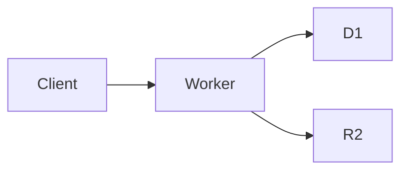

# feature-cookbook-documentation

**Issue:** Documentation — code docs, API docs, runbooks
**Date:** 2026-08-09
**Status:** documented

## Symptom
Your codebase is 100k lines. You onboard a new engineer.
They ask "where do I find X?" You point them at the
code. They spend a week looking. You wish you had
docs.

## Root cause
**Without docs, knowledge is tribal.** Document
deliberately.

**Source:** Various technical writing guides.

## The "doc types" pattern

For different audiences, different doc types:
- **README:** Project overview, setup, deploy
- **Code comments:** Why, not what
- **API docs:** Endpoints, schemas, examples
- **Architecture docs:** High-level design
- **Runbooks:** Operational procedures
- **Tutorials:** Step-by-step guides
- **ADRs:** Decision records

The doc type matches the audience.

## The "README" pattern

For a good README:
```markdown
# <Project Name>

<One-line description>

## Features
- Feature 1
- Feature 2

## Quick start
\`\`\`bash
npm install
npm run dev
\`\`\`

## Documentation
- Architecture
- API reference
- Deployment

## Contributing
See CONTRIBUTING.md

## License
MIT
```

The README is the front door.

## The "doc structure" pattern

For a docs folder:
```
/docs
  /architecture
    - overview.md
    - data-model.md
    - api-design.md
  /guides
    - getting-started.md
    - deployment.md
    - monitoring.md
  /runbooks
    - incident-response.md
    - disaster-recovery.md
  /api
    - authentication.md
    - endpoints.md
    - webhooks.md
  /decisions
    - 0001-use-cloudflare.md
    - 0002-monorepo.md
```

The structure is searchable.

## The "code comment" pattern

For code comments:
```ts
// ❌ Bad: comment that says what the code does
// Increment the counter
counter++;

// ✅ Good: comment that says why
// Cap retries at 3 to avoid exponential backoff blowing up
// at 24h — the job is time-sensitive
const MAX_RETRIES = 3;
```

The comment explains the why.

## The "TSDoc / JSDoc" pattern

For function docs:
```ts
/**
 * Compute the user's effective role.
 *
 * Takes into account explicit roles, team membership, and
 * feature-flag-based temporary elevations.
 *
 * @param user - The user
 * @param env - The environment
 * @returns The effective role
 */
async function effectiveRole(user: User, env: Env): Promise<Role> {
  // ...
}
```

The function is self-documenting.

## The "OpenAPI" pattern

For API docs, use OpenAPI:
```yaml
openapi: 3.0.0
info:
  title: My API
  version: 1.0.0
paths:
  /users/{id}:
    get:
      summary: Get a user
      parameters:
        - name: id
          in: path
          required: true
          schema:
            type: string
      responses:
        '200':
          description: A user
          content:
            application/json:
              schema:
                $ref: '#/components/schemas/User'
```

OpenAPI generates client SDKs + docs.

**Source:** OpenAPI spec:
https://swagger.io/specification/

## The "runbook" pattern

For a runbook:
```markdown
# Runbook: Site is down

## Symptoms
- Users report 500 errors
- Status page shows red
- Health check fails

## Diagnosis
1. Check the status page: https://status.example.com
2. Run `curl https://api.example.com/health`
3. Check the LB origin health
4. Check the DB connection pool

## Mitigation
- If origin is down: restart it
- If DB is down: failover to standby
- If deploy is broken: rollback

## Post-incident
- Write a post-mortem within 48h
- Add monitoring for the root cause
```

The runbook is actionable.

## The "tutorial" pattern

For a tutorial:
```markdown
# Tutorial: Build a CRUD app

## Step 1: Set up
\`\`\`bash
npm init -y
npm install cloudflare-workers
\`\`\`

## Step 2: Create the table
\`\`\`sql
CREATE TABLE users (
  id TEXT PRIMARY KEY,
  email TEXT NOT NULL
);
\`\`\`

## Step 3: Build the endpoint
\`\`\`ts
export default {
  async fetch(request, env) {
    return Response.json({ ok: true });
  },
};
\`\`\`
```

The tutorial is hands-on.

## The "API doc" pattern

For API docs:
```markdown
# POST /api/users

Create a new user.

## Request
\`\`\`json
{
  "email": "alice@example.com",
  "displayName": "Alice"
}
\`\`\`

## Response
\`\`\`json
{
  "id": "u_123",
  "email": "alice@example.com",
  "displayName": "Alice"
}
\`\`\`

## Errors
- 400: Invalid input
- 409: Email already exists
- 500: Server error

## Example
\`\`\`bash
curl -X POST https://api.example.com/api/users \\
  -H "Content-Type: application/json" \\
  -d '{"email":"alice@example.com"}'
\`\`\`
```

The API doc has an example.

## The "diagram" pattern

For architecture docs:
- **C4 model:** Context, containers, components, code
- **Sequence diagram:** How services communicate
- **ER diagram:** Data model
- **Flow chart:** Decision flow

Use Mermaid (renders in GitHub):


A diagram is worth 1k words.

## The "doc as code" pattern

For docs in the repo:
```
/docs
  *.md
```

CI builds + deploys them:
- **Docusaurus:** Static site
- **VitePress:** Vite-powered
- **Mintlify:** Hosted
- **GitHub Pages:** Free

Docs are versioned with code.

## The "doc maintenance" pattern

For doc maintenance:
- **On every PR:** Update relevant docs
- **Quarterly review:** Stale docs
- **PR review:** Check the docs
- **Doc CI:** Build + link check

A doc is only as good as its freshness.

## The "doc ownership" pattern

For ownership:
- **Code doc:** Code author
- **API doc:** API team
- **Runbook:** Ops team
- **Tutorial:** Developer relations

The owner is responsible.

## The "doc anti-pattern" anti-patterns

### 1. Stale docs
- **Issue:** Docs are out of date
- **Fix:** Update with code

### 2. No docs
- **Issue:** Tribal knowledge
- **Fix:** Document as you build

### 3. Wall of text
- **Issue:** Nobody reads
- **Fix:** Concise + diagrams

### 4. No examples
- **Issue:** Hard to use
- **Fix:** Show, don't tell

### 5. Doc in code only
- **Issue:** Hard to discover
- **Fix:** Central docs site

### 6. No search
- **Issue:** Can't find anything
- **Fix:** Search + tags

## Verification
- **Test:** Doc links work
- **Test:** Doc is up to date
- **Test:** New engineer can onboard
- **Live:** Doc is searchable
- **Audit:** Quarterly doc review

## Gotchas
- **The "stale docs" anti-pattern.** Update with code.
- **The "no examples" anti-pattern.** Show, don't tell.
- **The "wall of text" anti-pattern.** Be concise.
- **The "no search" anti-pattern.** Make it findable.

## Related
- `feature-cookbook-feature-lifecycle.md`
- `feature-cookbook-rfc-process.md`
- `feature-cookbook-incident-response.md`
- `feature-cookbook-disaster-recovery.md`
- Docusaurus: https://docusaurus.io/
- OpenAPI: https://swagger.io/specification/
- C4 model: https://c4model.com/
- Mermaid: https://mermaid.js.org/
