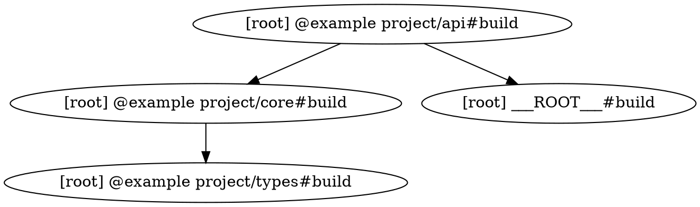

# Turborepo Task Graph Visualization Debugging

Date: 2026-08-23 / Author: example.com / Status: production

---

## Symptom / Use-case

A `turbo run build` in the example project monorepo completes but a downstream Worker
is not rebuilt after you change a shared package. Or the opposite: an unrelated
package is being rebuilt on every push, blowing CI time. You need to see the
exact dependency graph Turborepo constructs from your `turbo.json` and
`package.json` files without guessing.

---

## Context

Turborepo models tasks as a DAG (Directed Acyclic Graph). Each node is a
`<package>#<task>` pair; edges are drawn from `dependsOn` entries in
`turbo.json` and from `dependencies` / `devDependencies` in `package.json`.

When something is wrong — missing rebuilds, spurious cache misses, tasks
running out of order — the graph is almost always the source of truth. Two
complementary tools expose it:

1. `turbo run <task> --graph` — emits a DOT-format graph to stdout.
2. `turbo run <task> --dry=json` — emits execution plan JSON.
3. Turborepo's built-in `turbo graph` subcommand (≥ 2.x).

The example project stack uses Turborepo ≥ 2.0 with a `turbo.json` at the repo root
and per-package `turbo.json` overrides in `packages/*/`.

---

## Generating the DOT graph

```bash
# Full build graph across all packages
pnpm turbo run build --graph

# Limit to a single package and its transitive deps
pnpm turbo run build --filter='@example project/api' --graph

# Pipe to a file for rendering
pnpm turbo run build --graph 2>/dev/null | tee /tmp/example project-build.dot
```

The output is a Graphviz DOT file:



---

## Rendering the graph locally

```bash
# Option A: Graphviz (brew install graphviz / apt install graphviz)
pnpm turbo run build --graph 2>/dev/null \
  | dot -Tsvg -o /tmp/example project-build.svg
open /tmp/example project-build.svg

# Option B: Online renderer (paste DOT text)
# https://dreampuf.github.io/GraphvizOnline/

# Option C: mermaid-js export (Turborepo 2.x --graph=mermaid)
pnpm turbo run build --graph=mermaid 2>/dev/null \
  | tee /tmp/example project-build.mmd
# Then paste into https://mermaid.live
```

---

## Reading the dry-run JSON

The graph alone does not show which tasks are cache-HIT vs cache-MISS. The
`--dry=json` flag exposes the full execution plan with cache status:

```bash
pnpm turbo run build --dry=json | jq '.' > /tmp/dry-run.json
```

Key fields in the JSON:

```jsonc
{
  "tasks": [
    {
      "taskId": "@example project/core#build",
      "task": "build",
      "package": "@example project/core",
      "hash": "a1b2c3d4e5f6...",
      "cacheState": {
        "local": false,    // not in local cache
        "remote": true     // HIT in remote Turborepo cache (R2)
      },
      "command": "tsc -p tsconfig.build.json",
      "inputs": ["src/**/*.ts", "tsconfig.build.json"],
      "outputs": ["dist/**"],
      "dependencies": ["@example project/types#build"],
      "dependents": ["@example project/api#build", "@example project/worker#build"]
    }
  ]
}
```

Extract only the tasks that will actually execute (cache MISS):

```bash
jq '[.tasks[] | select(.cacheState.local == false and .cacheState.remote == false)]' \
  /tmp/dry-run.json
```

---

## turbo graph subcommand (≥ 2.x)

Turborepo 2.x ships a dedicated `turbo graph` command that generates the
_package_ dependency graph independently of any task:

```bash
# Package graph (not task graph)
pnpm turbo graph

# Task graph for a specific task
pnpm turbo graph --task build

# Output formats: dot (default), mermaid
pnpm turbo graph --task build --output mermaid
```

The package graph is useful for answering "which packages depend on
`@example project/types`?" without knowing which task to inspect.

---

## Diagnosing missing rebuilds

**Scenario**: You changed `packages/types/src/index.ts` but `packages/api` was
not rebuilt.

```bash
# 1. Confirm @example project/api has @example project/types in dependencies
cat packages/api/package.json | jq '.dependencies'

# 2. Check the build graph — @example project/api#build should depend on @example project/types#build
pnpm turbo run build --filter='@example project/api' --graph 2>/dev/null \
  | grep types

# 3. Check turbo.json inputs for @example project/api
cat packages/api/turbo.json 2>/dev/null || cat turbo.json | jq '.tasks.build'
```

Common causes:

| Root cause | Fix |
|---|---|
| `@example project/types` missing from `dependencies` in `package.json` | Add it |
| `turbo.json` task missing `"dependsOn": ["^build"]` | Add `"^build"` |
| `inputs` glob in `turbo.json` doesn't cover changed file | Broaden glob |
| Package not in `pnpm-workspace.yaml` glob | Add the package path |

---

## Diagnosing spurious cache misses

When every `turbo run build` is a full rebuild despite no code changes, hash
inputs are non-deterministic.

```bash
# Run build twice; compare hashes
pnpm turbo run build --dry=json | jq '[.tasks[].hash]' > /tmp/hashes1.json
# (make no changes)
pnpm turbo run build --dry=json | jq '[.tasks[].hash]' > /tmp/hashes2.json
diff /tmp/hashes1.json /tmp/hashes2.json
```

If hashes differ, the input files are changing between runs. Common culprits:

```bash
# Find files modified by the build itself that might be in turbo inputs
git status --short packages/
# If generated files appear here, add them to .gitignore AND turbo outputs[]
```

Add non-deterministic outputs to `turbo.json` outputs so they are restored from
cache rather than regenerated:

```jsonc
// turbo.json
{
  "tasks": {
    "build": {
      "inputs": ["src/**/*.ts", "tsconfig.build.json"],
      "outputs": ["dist/**", ".wrangler/**"],  // <-- include wrangler artifacts
      "dependsOn": ["^build"]
    }
  }
}
```

---

## Visualising affected packages for a PR

```bash
# Which packages are affected by changes in this branch vs main?
pnpm turbo run build --filter='[origin/main]' --dry=json \
  | jq '[.tasks[].package] | unique | sort'
```

Embed this in a GitHub Actions step to post a PR comment listing affected
Workers:

```yaml
- name: Compute affected packages
  id: affected
  run: |
    AFFECTED=$(pnpm turbo run build --filter='[origin/${{ github.base_ref }}]' \
      --dry=json 2>/dev/null | jq -r '[.tasks[].package] | unique | sort | .[]')
    echo "packages<<EOF" >> $GITHUB_OUTPUT
    echo "$AFFECTED" >> $GITHUB_OUTPUT
    echo "EOF" >> $GITHUB_OUTPUT

- name: Comment affected packages on PR
  uses: actions/github-script@v7
  with:
    script: |
      const affected = `${{ steps.affected.outputs.packages }}`;
      await github.rest.issues.createComment({
        ...context.repo,
        issue_number: context.issue.number,
        body: `**Affected packages in this PR:**\n\`\`\`\n${affected}\n\`\`\``
      });
```

---

## Anti-patterns

- **Using `--graph` output for CI gating** — the DOT format is not stable
  across Turborepo minor versions. Use `--dry=json` for machine-readable data.
- **Omitting `"^build"` in `dependsOn`** — Turborepo will not order tasks by
  package dependency; builds may race or use stale artifacts.
- **Putting generated files in `inputs`** — causes hash instability. Always
  list only source files in `inputs` and generated files in `outputs`.
- **Wide `inputs: ["**"]` glob** — includes `node_modules`, lock files, and OS
  metadata causing spurious misses. Be explicit.
- **Not committing `turbo.json` changes** — task graph changes are invisible in
  PR diff if the config file is gitignored.

---

## Gotchas

- `--graph` sends the DOT output to **stderr** in Turborepo 1.x and **stdout**
  in Turborepo 2.x. The `2>/dev/null` idiom in the examples above handles both:
  use `|&` or redirect explicitly depending on your version.
- Turborepo treats workspace root tasks (`//`) specially. They appear as
  `"___ROOT___#<task>"` in the graph. If you see unexpected root task edges,
  check `turbo.json` at the workspace root.
- `--filter='[HEAD^1]'` compares HEAD against its first parent. In a merge
  commit this is the base branch tip, which may differ from `origin/main` after
  a squash merge.
- `turbo graph` (without `--task`) shows the package graph, NOT the task
  graph. They look similar but the package graph has no task-level edges.
- Running `turbo run build --graph` inside a package subdirectory requires
  either `--cwd ../../` or running from the workspace root.

---

## Verification

```bash
# 1. Confirm graph renders with no parse errors
pnpm turbo run build --graph 2>&1 | dot -Tsvg > /dev/null && echo "Graph valid"

# 2. Confirm dry-run produces valid JSON
pnpm turbo run build --dry=json | python3 -m json.tool > /dev/null \
  && echo "JSON valid"

# 3. Touch a shared package and confirm downstream is in dry-run
touch packages/types/src/index.ts
pnpm turbo run build --filter='[HEAD]' --dry=json \
  | jq '[.tasks[].package] | sort'
git checkout -- packages/types/src/index.ts
```

---

## Related

- `documentation/docs/policies/worktree/monorepo-turborepo-remote-cache-ci.md`
- `documentation/docs/policies/worktree/turborepo-remote-cache-cloudflare-r2-backend.md`
- `documentation/docs/policies/worktree/monorepo-affected-builds-2026.md`
- `documentation/docs/policies/worktree/monorepo-nx-turborepo-comparison.md`
- `documentation/docs/policies/worktree/ci-cache-optimization-github-actions.md`

---

## Sources

- Turborepo — Running tasks — https://turbo.build/repo/docs/crafting-your-repository/running-tasks
- Turborepo — Caching — https://turbo.build/repo/docs/crafting-your-repository/caching
- Turborepo CLI — `turbo graph` — https://turbo.build/repo/docs/reference/graph
- Graphviz DOT language — https://graphviz.org/doc/info/lang.html
- Turborepo task inputs/outputs — https://turbo.build/repo/docs/reference/configuration#inputs
